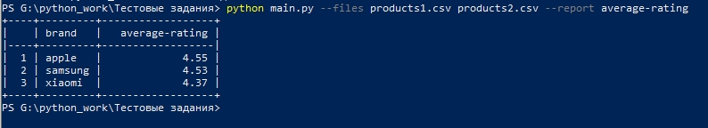

# Анализ рейтинга брендов
Скрипт читает файлы с данными (см. примеры ниже) о рейтингах товаров и формирует отчеты. Нужно сформировать всего один отчёт average-rating (см. пример ниже). Отчёт включает в себя список брендов и средний рейтинг бренда, бренды сортируются по рейтингу. Название файлов (может быть несколько) и название отчета передается в виде параметров --files и --report (см. пример ниже). Отчёт формируется по всем переданных файлам, а не по каждому отдельно.



<!--Установка-->
# Установка (Windows)

1. Клонирование репозитория 

```git clone https://github.com/ekaterina3333/average_rating.git```

2. Создание виртуального окружения

```python -m venv venv```


3. Активация виртуального окружения

```source venv/Scripts/activate```

4. Установка зависимостей

```pip install -r requirements.txt```

6. Запуск скрипта для демонстрации возможностей 

```python3 main.py --help```

<!--Примечание-->
Новый отчет можно добавить, изменив индексы и условие на average-price